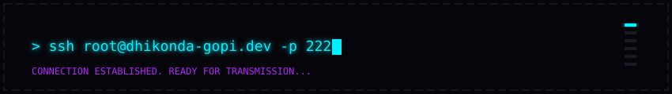

<!-- ========================= HERO ========================= -->

<div align="center">



</div>

<br>

<div align="center">

# 

</div>

---

# > boot_sequence

```text
████████████████████████████████████████████

> Loading Neural Engine.............100%

> Loading Security Kernel...........100%

> Loading MERN Stack................100%

> Connecting to AI Modules..........100%

> Initializing Portfolio............100%

> Access Granted.

████████████████████████████████████████████
```

---

# > whoami

```yaml
NAME:
  Dhikonda Gopi

LOCATION:
  India

UNIVERSITY:
  Parul University

DEGREE:
  B.Tech Computer Science
  (Cyber Security)

GRADUATION:
  2027

ROLE:
  Full Stack Developer

SPECIALIZATION:
  Cyber Security
  AI/ML
  MERN Stack

CURRENTLY:
  Building intelligent enterprise applications,
  AI systems,
  modern web platforms,
  and cybersecurity tools.

STATUS:
  Available for
  Internships
  Freelance
  Full-Time Opportunities
```

---

<div align="center">


</div>

---


# > system --skills

<div align="center">



</div>

---

## ⚡ TECH STACK

<div align="center">


</div>

---

## > loaded_modules

```text
[████████████████████████] C++               90%

[██████████████████████░░] JavaScript        88%

[█████████████████████░░░] React             87%

[████████████████████░░░░] Node.js           84%

[████████████████████░░░░] Express.js        84%

[███████████████████░░░░░] MongoDB           82%

[███████████████████░░░░░] Supabase          82%

[██████████████████░░░░░░] Python            80%

[█████████████████░░░░░░░] Docker            75%

[█████████████████░░░░░░░] Linux             75%

```

---

# > technology_matrix

| Frontend | Backend | Database | AI / ML | Cyber Security | DevOps |
|-----------|----------|----------|----------|----------------|---------|
| React | Node.js | MongoDB | Python | Kali Linux | Docker |
| Tailwind CSS | Express.js | Supabase | Gemini AI | Networking | GitHub |
| HTML5 | REST API | MySQL | APIs | Linux | Vercel |

---

## ⚙ Development Environment

<div align="center">


</div>


---

<div align="center">

### 💻 Always Learning • Always Building • Always Improving

</div>

---

# > ls projects

<div align="center">



</div>

---


### Technology Stack

<div align="center">


</div>

---

### Features

- ✅ Enterprise Dashboard
- ✅ Asset Tracking
- ✅ Department Management
- ✅ Booking System
- ✅ Maintenance Workflow
- ✅ Audit Logs
- ✅ Notifications
- ✅ Reports
- ✅ Role-Based Authentication
- ✅ Responsive UI

---

<div align="center">

[](https://github.com/dhikondagopi/Assest_flow-main)

<!-- Replace with your deployed URL when available -->
[](YOUR_LIVE_URL)

</div>

---

<br>

<div align="center">



</div>

---

# ☕ CafePOS

> AI Powered Cafe Management Platform

### Overview

CafePOS is an intelligent point-of-sale system built for cafés and restaurants to streamline ordering, billing, inventory, employee management, customer engagement, and business analytics.

---

### Modules

```text
☕

Customer Orders

💳

Billing & Payments

📦

Inventory Management

👨‍🍳

Kitchen Dashboard

👨‍💼

Employee Management

📈

Sales Analytics

📅

Reservations

🎁

Loyalty Programs

🤖

AI Business Insights
```

---

### Technology Stack

<div align="center">


</div>

---

### Features

- ☕ Smart Order Management
- 📦 Inventory Tracking
- 💳 Billing System
- 👥 Employee Management
- 📊 Business Analytics
- 🤖 AI Recommendations
- 📱 Responsive Design
- ⚡ Fast Performance
- 🔒 Secure Authentication

---

<div align="center">

<!-- Replace with your actual repository -->
[](https://github.com/dhikondagopi)

<!-- Replace with your deployed URL -->
[](YOUR_LIVE_URL)

</div>

---

<div align="center">

## 🚀 More exciting projects are currently under development...

</div>

---

# > analytics

<div align="center">


</div>

---

<div align="center">


</div>

---

<div align="center">


</div>

---

<div align="center">


</div>

---

<div align="center">

<picture>

<source media="(prefers-color-scheme: dark)"
srcset="https://raw.githubusercontent.com/dhikondagopi/dhikondagopi/output/github-contribution-grid-snake-dark.svg"/>

<source media="(prefers-color-scheme: light)"
srcset="https://raw.githubusercontent.com/dhikondagopi/dhikondagopi/output/github-contribution-grid-snake.svg"/>


</picture>

</div>

---

# > current_status

```text
━━━━━━━━━━━━━━━━━━━━━━━━━━━━━━━━━━━━━━━━━━

SYSTEM STATUS

🟢 ONLINE

CURRENT PROJECT

🏢 AssetFlow Enterprise ERP

NEXT PROJECT

☕ CafePOS AI Platform

CURRENT LEARNING

Artificial Intelligence

Machine Learning

System Design

Backend Architecture

GOAL

Software Engineer

━━━━━━━━━━━━━━━━━━━━━━━━━━━━━━━━━━━━━━━━━━
```

---

# > achievements

```text
✓ Enterprise ERP Development

✓ MERN Stack Projects

✓ AI Integration

✓ Cyber Security Learning

✓ Full Stack Development

✓ Database Design

✓ REST API Development

✓ Modern UI Development
```

---

# > connect

<div align="center">

<a href="https://github.com/dhikondagopi">

</a>

<a href="https://www.linkedin.com/in/YOUR-LINKEDIN">

</a>

<a href="mailto:YOUR_EMAIL@gmail.com">

</a>

<a href="https://leetcode.com/YOUR_USERNAME">

</a>

<a href="https://YOUR_PORTFOLIO_URL">

</a>

</div>

---

# > system_information

```yaml
Developer:
  Dhikonda Gopi

Role:
  Full Stack Developer

University:
  Parul University

Department:
  Computer Science (Cyber Security)

Interested In:
  - Full Stack Development
  - Artificial Intelligence
  - Cyber Security
  - Enterprise Software

Open To:
  - Software Engineer Internships
  - Full Time Opportunities
  - Open Source Collaboration
```

---

<div align="center">

### ⚡ "Build. Learn. Ship. Repeat."



</div>

---

<div align="center">

⭐ Thanks for visiting my profile ⭐

If you like my work,

leave a ⭐ on my repositories.

</div>


---

# > developer_console

```bash
$ developer --status

━━━━━━━━━━━━━━━━━━━━━━━━━━━━━━━━━━━━━━━━━━━━━━

👤 USER            : Dhikonda Gopi

🟢 STATUS          : ONLINE

💻 ROLE            : Full Stack Developer

🛡 SPECIALIZATION  : Cyber Security

🤖 AI ENGINE       : ACTIVE

🚀 CURRENT BUILD   : AssetFlow ERP

☕ NEXT BUILD      : CafePOS

📚 LEARNING        : Artificial Intelligence

🏆 TARGET          : Software Engineer

━━━━━━━━━━━━━━━━━━━━━━━━━━━━━━━━━━━━━━━━━━━━━━
```

---

# > roadmap

```text
2025
│
├── Learn MERN Stack ✅
├── Build Full Stack Projects ✅
├── Learn Cyber Security ✅
│
2026
│
├── Build Enterprise ERP 🚀
├── Build CafePOS 🚀
├── Learn AI/ML 🚀
├── Master System Design
│
2027
│
├── Crack Product Companies
├── Software Engineer
├── Open Source Contributions
└── Build Startup
```

---

# > currently_learning

<div align="center">

| Technology | Progress |
|------------|----------|
| MERN Stack | ████████████████████ 100% |
| TypeScript | █████████████████░░ 85% |
| AI / ML | ████████████░░░░░░░ 60% |
| System Design | ██████████░░░░░░░░ 50% |
| Docker | █████████████░░░░░░ 70% |
| Kubernetes | ███████░░░░░░░░░░░ 35% |

</div>

---

# > operating_environment

<div align="center">


</div>

---

# > fun_fact

```text
while(alive){

    Learn();

    Build();

    Debug();

    Ship();

    Repeat();

}
```

---

# > visitor_message

```text
━━━━━━━━━━━━━━━━━━━━━━━━━━━━━━━━━━━━━━━━━━━━━━

Thanks for visiting my GitHub profile.

Feel free to explore my repositories,
connect with me,
or collaborate on exciting projects.

Let's build something amazing together.

━━━━━━━━━━━━━━━━━━━━━━━━━━━━━━━━━━━━━━━━━━━━━━
```

---

<div align="center">

### ⭐ If you like my work, consider giving a ⭐ to my repositories.


</div>

---


---

# > system_services

```text
━━━━━━━━━━━━━━━━━━━━━━━━━━━━━━━━━━━━━━━━━━━━━━━━━━━━━━━━━━━━━━

RUNNING SERVICES

🟢 Portfolio Engine             ONLINE

🟢 GitHub API                   CONNECTED

🟢 AI Learning Engine           ACTIVE

🟢 MERN Development             RUNNING

🟢 Cyber Security Lab           ACTIVE

🟢 AssetFlow ERP                DEPLOYED

🟢 CafePOS                      IN DEVELOPMENT

━━━━━━━━━━━━━━━━━━━━━━━━━━━━━━━━━━━━━━━━━━━━━━━━━━━━━━━━━━━━━━
```

---

# > terminal

```bash
$ status

Developer ............. Online

Projects .............. 2 Active

Repositories .......... Growing

Coffee ................ Loading...

Learning .............. AI + System Design

Target ................ Software Engineer

$ exit
```

---

# > quote

<div align="center">

## 💻

> **"Great software isn't built by writing more code.  
> It's built by solving the right problems."**

</div>

---

# > connect

<div align="center">

<a href="https://github.com/dhikondagopi">

</a>

<a href="https://www.linkedin.com/in/YOUR_LINKEDIN">

</a>

<a href="mailto:YOUR_EMAIL@gmail.com">

</a>

<a href="https://leetcode.com/YOUR_LEETCODE">

</a>

<a href="https://YOUR_PORTFOLIO_URL">

</a>

</div>

---

<div align="center">

## Thanks for visiting my profile ❤️

If you like my work,

⭐ Star my repositories

🤝 Connect with me

🚀 Let's build something amazing together

</div>

---

# > shutdown

```text
━━━━━━━━━━━━━━━━━━━━━━━━━━━━━━━━━━━━━━━━━━━━━━

Saving Session...

Disconnecting AI Core...

Stopping Background Services...

Logging Activity...

Session Saved Successfully.

Developer OS v3.0

STATUS : OFFLINE

Goodbye 👋

━━━━━━━━━━━━━━━━━━━━━━━━━━━━━━━━━━━━━━━━━━━━━━
```

<div align="center">


</div>

---
